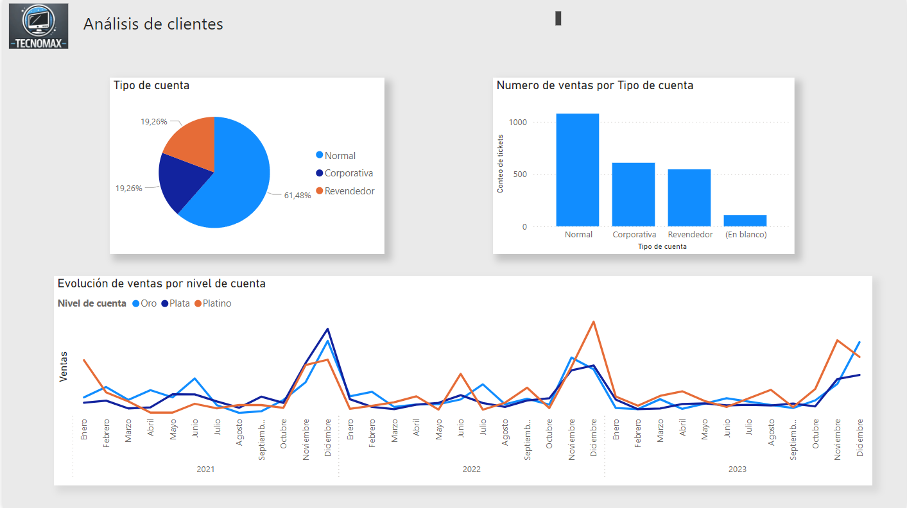

# Tecnomax Sales Analysis

## Project Overview
This project involved analyzing sales performance across multiple stores to identify top products, store performance, and seasonal trends.

**Objective**: Provide insights for optimized decision-making around inventory and sales.

**Key Components**:
- **Data Model**: Built a relational model connecting stores, products, and sales data.
- **Data Manipulation**: Used calculated columns for revenue metrics and data transformations for cleaner analysis.

## Data Model
The data used in this project was stored across three CSV files, each representing a separate year of sales data. These files were combined and cleaned to form a comprehensive dataset, connecting information from stores, products, and individual sales.

*Data model showing relationships between key tables such as Sales, Products, and Stores, built from multiple CSV files.*

## Dashboards

This analysis included five key dashboards, each focusing on different aspects of the enterprise's performance.

### 1. Sales Overview

*This dashboard highlights key performance metrics, including total sales, average sale value, and sales quantity through a set of summary cards. A line chart visualizes sales trends over time, while bar graphs display the top-performing stores and top sellers.*

### 2. Product Analysis

*This dashboard includes a matrix showcasing products by category across stores, with a conditional heatmap overlay to indicate sales intensity. It also features a bar graph displaying the most sold products, layered with an income metric line for comparative analysis. Another bar graph highlights the most demanded categories, also paired with the income metric line to emphasize profitability.*

### 3. Store Comparison

*This dashboard presents an in-depth look at individual store performance with four bar graphs: total sales by store, top-performing salespeople, product availability per store, and the number of active sellers at each location. Each store is represented consistently with the same color across all graphs, making it easy to identify patterns and compare performance metrics*

### 4. Customer Insights

*This dashboard focuses on account segmentation, displaying a pie chart of the distribution of different account types. A bar chart provides a breakdown of total sales by each account type, while a line chart tracks sales trends over time for each type, offering insights into the buying behavior of different customer groups.*

### 5. Annual Trends

*Long-term sales and profitability trends to identify patterns and plan for the future.*

